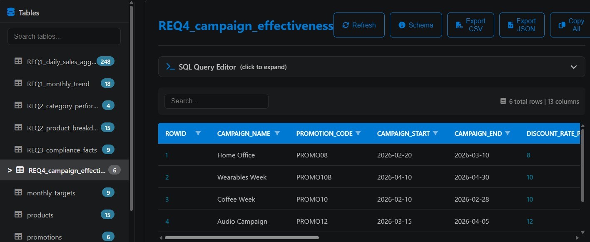
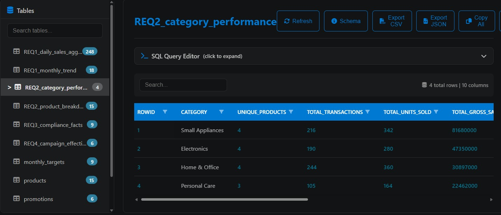
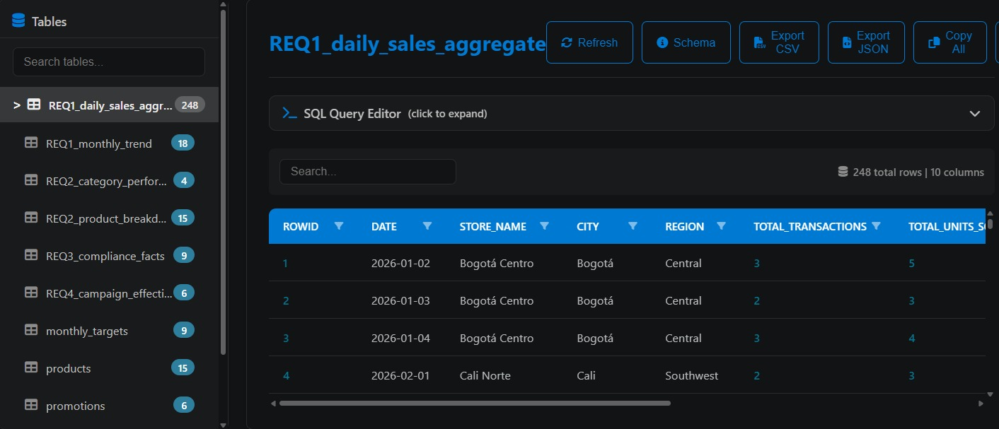

## Lab 1B – From Business Requirements to a Basic ETL Pipeline 🧪

Below you will find explanations of the requirements, design, and implementation, along with step-by-step instructions for executing everything.

## 1. Selected Business Requirements & Traceability 📋

| # | Business Requirement | Required Data | Pipeline Block | Expected Output |
|---|---|---|---|---|
| 1 | Monitor total revenue | sale_date, store_id, quantity, unit_price, stores.csv | Transform / Integrate | Gross and net sales aggregated by region and branch |
| 2 | Identify sales performance by product category | product_id, quantity, unit_price, products.csv | Transform / Integrate | Total revenue and units sold grouped by category |
| 3 | Evaluate monthly sales target achievement per store | store_id, sale_date, net_sales, monthly_targets.csv | Transform / Integrate | Target compliance percentage per branch/month |
| 4 | Monitor the impact of promotions | promotion_code, sale_date, promotions.csv, gross_sales | Transform / Integrate | Discounts applied and net sales under campaigns |

## 2. System Architecture & Pipeline Design 📐

The ETL pipeline is designed as a modular system where each block handles a specific stage of the data lifecycle. Below is the block diagram and the corresponding technical responsibilities for each stage:


### Pipeline Block Responsibilities

| Block | Input | Processing Responsibility | Output | Possible Failure |
| :--- | :--- | :--- | :--- | :--- |
| **Extract** | `sales_cali.csv`, `sales_bogota.json`, `sales_medellin.xml`, and reference CSV files | Read heterogeneous transactional files and reference tables, converting each raw format into a `pandas.DataFrame` with a standardized schema without performing business calculations. | List of raw `pandas.DataFrame` objects under a unified schema | File not found, incorrect file paths, or corrupted file syntax (e.g., malformed XML/JSON) |
| **Profile** | Raw transactional DataFrames | Inspect the combined extracted data to detect total row counts, data types, missing values, duplicate `sale_line_id` values, invalid quantities/prices (<= 0), and date anomalies. | Console summary and log report detailing data quality findings | Memory overflow or unhandled exceptions due to unexpected null structures |
| **Clean / Harmonize** | Raw DataFrames and profiling findings | Apply data quality rules: remove whitespace, standardize text casing, cast date strings to uniform datetime types, convert numerical values, drop duplicate `sale_line_id`s, and reject invalid rows (<= 0). | Cleaned and harmonized DataFrame (`clean_transactions`) | Over-filtering leading to unexpected loss of valid transactional records |
| **Transform / Integrate** | `clean_transactions` + Master tables (`products`, `stores`, `promotions`, `monthly_targets`) | Perform relational `JOIN`s with reference tables, calculate `gross_sales`, `discount_amount`, `net_sales`, and extract temporal attributes (`month`, `week`, `day_name`). | Fully integrated and enriched analytical DataFrame | Key mismatch during `JOIN`s (e.g., unmapped `product_id` or `store_id`) |
| **Validate** | Integrated analytical DataFrame | Enforce data quality assertion checks before loading: verify `sale_line_id` uniqueness, ensure no null IDs/dates, validate positive sales figures, and confirm foreign key integrity. | Validation pass confirmation or execution halt log | Critical assertion failure (e.g., negative `net_sales` or unmapped foreign keys) stopping the pipeline |
| **Load** | Validated analytical DataFrame | Export the clean integrated dataset to `data/processed/integrated_sales.csv` and insert all records into the `sales_analytics` table inside the SQLite database (`retail_analytics.db`). | Processed CSV file and populated SQLite database table | Database lock, file permission errors, or SQL schema creation failures |
| **Query** | SQLite database (`database/retail_analytics.db`) | Execute structured analytical SQL queries to answer the business questions and KPIs defined in Lab 1A. | Tabular query results displayed in console verifying requirement satisfaction | SQL syntax errors or table/column name mismatches |

## 3.	Project structure. 🗂️
```text
LAB1B_ETL/
│
├── data/
│   ├── processed/
│   │   └── integrated_sales.csv
│   │
│   └── raw/
│       ├── monthly_targets.csv
│       ├── products.csv
│       ├── promotions.csv
│       ├── sales_bogota.json
│       ├── sales_cali.csv
│       ├── sales_medellin.xml
│       └── stores.csv
│
├── database/
│   └── retail_analytics.db
│
├── docs/
│   ├── Documentation with Analysis and Solution for the Retail Company.docx
│   └── ETL-G1_2026-2_U1_Lab-1B.docx
│
├── images/
│   ├── campaign_effectiveness.jpeg
│   ├── category_performance.jpeg
│   ├── daily_sales_aggregate.jpeg
│   └── pipeline_diagram.png
│
├── src/
│   ├── extract.py
│   ├── load.py
│   ├── main.py
│   ├── queries.py
│   └── transform.py
│
├── .gitignore
├── README.md
└── requirements.txt
```

## 4. Technologies Used 🛠️
- **Python** — Main programming language used in the project.
- **Pandas** — Data manipulation, transformation, and analysis.
- **NumPy** — Numerical operations and data structure handling.
- **lxml** — XML/HTML data processing and extraction.
- **SQL** — Data querying and analysis within the database.
- **SQLite** — Relational database used for storing the processed analytical data.
- **Git & GitHub** — Version control and repository management.


## 5. ETL Pipeline Implementation ⚙️

### Extraction Phase (`src/extract.py`)
The extraction module ingests data from three heterogeneous transaction sources and four master reference tables without applying business logic or transformations:

- **sales_cali.csv**: Extracted using `pandas.read_csv()`.
- **sales_bogota.json**: Parsed with Python's standard `json` library into a DataFrame.
- **sales_medellin.xml**: Parsed using `xml.etree.ElementTree` to flatten nested XML elements into tabular records.

All transaction sources are reindexed to conform to a **common schema**:
`sale_line_id`, `sale_date`, `store_id`, `product_id`, `quantity`, `unit_price`, `promotion_code`, and `payment_method`.


### Data Profiling Findings & Cleaning Decisions (`Activity 4 & 5`)

Upon extracting raw transactions from Cali (CSV), Bogotá (JSON), and Medellín (XML), the profiling block identified the following data quality issues:

| Profiling Issue Category | Discovery / Findings | Cleaning Decision & Rule Applied |
| :--- | :--- | :--- |
| **Duplicate Identifiers** | Duplicate `sale_line_id` values were detected across heterogeneous sources. | Drop duplicate `sale_line_id` records, keeping the first valid occurrence. |
| **Heterogeneous Date Formats** | Dates were stored in multiple string formats (e.g., `YYYY-MM-DD`, `DD/MM/YYYY`, ISO timestamps) with string whitespaces. | Trim whitespace and parse all dates into a standardized `YYYY-MM-DD` datetime format. Reject unparseable dates. |
| **Invalid Quantities** | Non-numeric entries, nulls, and negative/zero values (<= 0) were present in `quantity`. | Convert to numeric (`int`/`float`). Reject rows where `quantity` <= 0 or null. |
| **Invalid Unit Prices** | String formats, nulls, and non-positive prices (<= 0) were present in `unit_price`. | Cast to `float`. Reject rows where `unit_price` <= 0 or null. |
| **Missing Promotion Codes** | Null/empty values represent sales where no promotional discount was applied. | Fill missing `promotion_code` values with standard representation `'NONE'`. |
| **Text Whitespaces & Casing** | Trailing whitespaces and mixed casing in `store_id`, `product_id`, and `payment_method`. | Strip leading/trailing whitespaces and convert text to uppercase/standardized casing. |


### Cleaning & Harmonization Phase (`src/transform.py`)

Based on the profiling results, the `clean_and_harmonize_data` module executes the following data standardization pipeline:

1. **Text Standardization**: Strips leading/trailing whitespaces from string identifiers (`sale_line_id`, `store_id`, `product_id`, `payment_method`) and converts store/product IDs to uppercase.
2. **Date Parsing**: Standardizes all heterogeneous date formats (e.g., ISO, mixed string dates) into a single `datetime` representation formatted as `YYYY-MM-DD`.
3. **Numeric Type Casting**: Converts `quantity` to integer and `unit_price` to floating-point numeric types.
4. **Promotion Code Normalization**: Replaces missing/null promotion codes with the standard placeholder `'NONE'`.
5. **Deduplication**: Removes duplicate `sale_line_id` records, retaining only the first valid occurrence.
6. **Record Quality Gate**: Filters out corrupted records containing unparseable dates, non-positive quantities (<= 0), or non-positive unit prices (<= 0).


### Transformation & Integration Phase (`src/transform.py`)

The integration block combines the cleaned transactional DataFrame with raw master tables (`products`, `stores`, `promotions`, and `targets`), computing mandatory business logic:

1. **Relational Merges**: Performs LEFT JOINs with master tables to attach product details, store region metadata, and promotion discount percentages.
2. **Financial Metrics Calculation**:
   - `gross_sales = quantity * unit_price`
   - `discount_amount = gross_sales * (discount_rate / 100)`
   - `net_sales = gross_sales - discount_amount`
3. **Temporal Enrichment**: Derives `year`, `month`, `week`, and `day_name` directly from the standardized `sale_date`.
4. **Data Quality Assertions**: Executes strict programmatic runtime assertions validating `sale_line_id` uniqueness, non-null mandatory fields, and non-negative net sales figures prior to data persistence.


### Loading Phase (`src/load.py`)

The loading module persists the final validated dataset into two storage targets:

1. **Processed CSV Export**: Writes the integrated dataset to `data/processed/integrated_sales.csv` for flat-file consumption or backups.
2. **SQLite Relational Persistence**: Connects to `database/retail_analytics.db` and writes the dataset into the `sales_analytics` table using `if_exists='replace'`. This guarantees pipeline idempotency during repeated runs while preparing the database for downstream analytical SQL queries.


### Analytical Queries Phase (`src/queries.py`)

The query execution module connects to `database/retail_analytics.db` to validate that all four target business requirements are answered directly through structured SQL queries:

It includes four main requirements:

1. **Daily Sales and Monthly Trends:** Analysis of transactions, units, and revenue.

2. **Performance by Category and Product:** Comparison of sales, revenue, and rankings.

3. **Goal Achievement:** Comparison between actual sales and monthly targets.

4. **Campaign Effectiveness:** Analysis of discounts, revenue, performance, and ROI.

The results are stored as separate tables in the SQLite database.

## 6. Execution Instructions 📖

### 1. Clone the repository

```bash
git clone https://github.com/michaelmaccardona-lgtm/Lab1B_ETL.git
```

### 2. Create & Activate the Environment 

Ensure you have `Python 3.9+` first. If not, you couldn't do the steps upcoming.

Afterwards, we'll create it with this instructions:

```bash
# Command in terminal
python -m venv .LAB1_ETL
```

To activate you should use:

```bash
.\.LAB1_ETL\Scripts\Activate
```
> In case you named with a different name replace the `.LAB1_ETL` with yours.

### 3. Install Dependencies

```bash
pip install -r requirements.txt
```

### 4. **Execute Orquestator**:

Run the main entry point from the project root:
```bash
python src/main.py
```

## 7. Recommendations 🖊️

To analize and visualize the database generated install the extension called `db viewer` if you're in VS Code.

## 8. Example/Screenshots of analytical results 📸 

### Campaign Effectiveness


### Category Performance


### Daily Sales Aggregate
