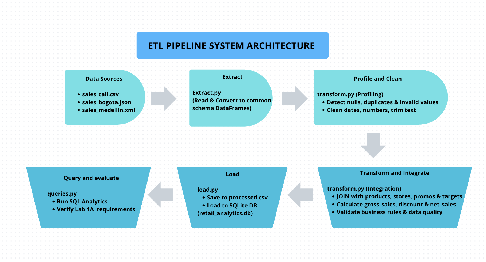

## 1. Selected Business Requirements & Traceability


| # | Business Requirement | Required Data | Pipeline Block | Expected Output |
|---|---|---|---|---|
| 1 | Monitor total revenue and sales by region/store | sale_date, store_id, quantity, unit_price, stores.csv | Transform / Integrate | Gross and net sales aggregated by region and branch |
| 2 | Identify sales performance by product category | product_id, quantity, unit_price, products.csv | Transform / Integrate | Total revenue and units sold grouped by category |
| 3 | Evaluate monthly sales target achievement per store | store_id, sale_date, net_sales, monthly_targets.csv | Transform / Integrate | Target compliance percentage per branch/month |
| 4 | Compare temporal sales trends (daily/weekly/monthly) | Sale transactions (sale_date, net_sales) | Transform / Integrate | Aggregated metrics by month, week, and day_name |
| 5 | Analyze promotion usage effectiveness | promotion_code, sale_date, promotions.csv, gross_sales | Transform / Integrate | Discounts applied and net sales under campaigns |
| 6 | Unify and standardize heterog


## 2. System Architecture & Pipeline Design

The ETL pipeline is designed as a modular system where each block handles a specific stage of the data lifecycle. Below is the block diagram and the corresponding technical responsibilities for each stage:



### Pipeline Block Responsibilities

| Block | Input | Processing Responsibility | Output | Possible Failure |
| :--- | :--- | :--- | :--- | :--- |
| **Extract** | `sales_cali.csv`, `sales_bogota.json`, `sales_medellin.xml`, and reference CSV files | Read heterogeneous transactional files and reference tables, converting each raw format into a `pandas.DataFrame` with a standardized schema without performing business calculations. | List of raw `pandas.DataFrame` objects under a unified schema | File not found, incorrect file paths, or corrupted file syntax (e.g., malformed XML/JSON) |
| **Profile** | Raw transactional DataFrames | Inspect the combined extracted data to detect total row counts, data types, missing values, duplicate `sale_line_id` values, invalid quantities/prices ($\le 0$), and date anomalies. | Console summary and log report detailing data quality findings | Memory overflow or unhandled exceptions due to unexpected null structures |
| **Clean / Harmonize** | Raw DataFrames and profiling findings | Apply data quality rules: remove whitespace, standardize text casing, cast date strings to uniform datetime types, convert numerical values, drop duplicate `sale_line_id`s, and reject invalid rows ($\le 0$). | Cleaned and harmonized DataFrame (`clean_transactions`) | Over-filtering leading to unexpected loss of valid transactional records |
| **Transform / Integrate** | `clean_transactions` + Master tables (`products`, `stores`, `promotions`, `monthly_targets`) | Perform relational `JOIN`s with reference tables, calculate `gross_sales`, `discount_amount`, `net_sales`, and extract temporal attributes (`month`, `week`, `day_name`). | Fully integrated and enriched analytical DataFrame | Key mismatch during `JOIN`s (e.g., unmapped `product_id` or `store_id`) |
| **Validate** | Integrated analytical DataFrame | Enforce data quality assertion checks before loading: verify `sale_line_id` uniqueness, ensure no null IDs/dates, validate positive sales figures, and confirm foreign key integrity. | Validation pass confirmation or execution halt log | Critical assertion failure (e.g., negative `net_sales` or unmapped foreign keys) stopping the pipeline |
| **Load** | Validated analytical DataFrame | Export the clean integrated dataset to `data/processed/integrated_sales.csv` and insert all records into the `sales_analytics` table inside the SQLite database (`retail_analytics.db`). | Processed CSV file and populated SQLite database table | Database lock, file permission errors, or SQL schema creation failures |
| **Query** | SQLite database (`database/retail_analytics.db`) | Execute structured analytical SQL queries to answer the business questions and KPIs defined in Lab 1A. | Tabular query results displayed in console verifying requirement satisfaction | SQL syntax errors or table/column name mismatches |


## 3. ETL Pipeline Implementation

### Extraction Phase (`src/extract.py`)
The extraction module ingests data from three heterogeneous transaction sources and four master reference tables without applying business logic or transformations:

- **sales_cali.csv**: Extracted using `pandas.read_csv()`.
- **sales_bogota.json**: Parsed with Python's standard `json` library into a DataFrame.
- **sales_medellin.xml**: Parsed using `xml.etree.ElementTree` to flatten nested XML elements into tabular records.

All transaction sources are reindexed to conform to a **common schema**:
`sale_line_id`, `sale_date`, `store_id`, `product_id`, `quantity`, `unit_price`, `promotion_code`, and `payment_method`.


### Data Profiling Findings & Cleaning Decisions (`Activity 4 & 5`)

Upon extracting raw transactions from Cali (CSV), Bogotá (JSON), and Medellín (XML), the profiling block identified the following data quality issues:

| Profiling Issue Category | Discovery / Findings | Cleaning Decision & Rule Applied |
| :--- | :--- | :--- |
| **Duplicate Identifiers** | Duplicate `sale_line_id` values were detected across heterogeneous sources. | Drop duplicate `sale_line_id` records, keeping the first valid occurrence. |
| **Heterogeneous Date Formats** | Dates were stored in multiple string formats (e.g., `YYYY-MM-DD`, `DD/MM/YYYY`, ISO timestamps) with string whitespaces. | Trim whitespace and parse all dates into a standardized `YYYY-MM-DD` datetime format. Reject unparseable dates. |
| **Invalid Quantities** | Non-numeric entries, nulls, and negative/zero values ($\le 0$) were present in `quantity`. | Convert to numeric (`int`/`float`). Reject rows where $\text{quantity} \le 0$ or null. |
| **Invalid Unit Prices** | String formats, nulls, and non-positive prices ($\le 0$) were present in `unit_price`. | Cast to `float`. Reject rows where $\text{unit\_price} \le 0$ or null. |
| **Missing Promotion Codes** | Null/empty values represent sales where no promotional discount was applied. | Fill missing `promotion_code` values with standard representation `'NONE'`. |
| **Text Whitespaces & Casing** | Trailing whitespaces and mixed casing in `store_id`, `product_id`, and `payment_method`. | Strip leading/trailing whitespaces and convert text to uppercase/standardized casing. |


### 6.  Cleaning & Harmonization Phase (`src/transform.py`)

Based on the profiling results, the `clean_and_harmonize_data` module executes the following data standardization pipeline:

1. **Text Standardization**: Strips leading/trailing whitespaces from string identifiers (`sale_line_id`, `store_id`, `product_id`, `payment_method`) and converts store/product IDs to uppercase.
2. **Date Parsing**: Standardizes all heterogeneous date formats (e.g., ISO, mixed string dates) into a single `datetime` representation formatted as `YYYY-MM-DD`.
3. **Numeric Type Casting**: Converts `quantity` to integer and `unit_price` to floating-point numeric types.
4. **Promotion Code Normalization**: Replaces missing/null promotion codes with the standard placeholder `'NONE'`.
5. **Deduplication**: Removes duplicate `sale_line_id` records, retaining only the first valid occurrence.
6. **Record Quality Gate**: Filters out corrupted records containing unparseable dates, non-positive quantities ($\le 0$), or non-positive unit prices ($\le 0$).


### 7.  Transformation & Integration Phase (`src/transform.py`)

The integration block combines the cleaned transactional DataFrame with raw master tables (`products`, `stores`, `promotions`, and `targets`), computing mandatory business logic:

1. **Relational Merges**: Performs LEFT JOINs with master tables to attach product details, store region metadata, and promotion discount percentages.
2. **Financial Metrics Calculation**:
   - $\text{gross\_sales} = \text{quantity} \times \text{unit\_price}$
   - $\text{discount\_amount} = \text{gross\_sales} \times \left(\frac{\text{discount\_rate}}{100}\right)$
   - $\text{net\_sales} = \text{gross\_sales} - \text{discount\_amount}$
3. **Temporal Enrichment**: Derives `year`, `month`, `week`, and `day_name` directly from the standardized `sale_date`.
4. **Data Quality Assertions**: Executes strict programmatic runtime assertions validating `sale_line_id` uniqueness, non-null mandatory fields, and non-negative net sales figures prior to data persistence.


### 8.  Loading Phase (`src/load.py`)

The loading module persists the final validated dataset into two storage targets:

1. **Processed CSV Export**: Writes the integrated dataset to `data/processed/integrated_sales.csv` for flat-file consumption or backups.
2. **SQLite Relational Persistence**: Connects to `database/retail_analytics.db` and writes the dataset into the `sales_analytics` table using `if_exists='replace'`. This guarantees pipeline idempotency during repeated runs while preparing the database for downstream analytical SQL queries.


### 9.  Analytical Queries Phase (`src/queries.py`)

The query execution module connects to `database/retail_analytics.db` to validate that all six target business requirements are answered directly through structured SQL queries:

1. **Req 1 (Sales by Region/Store)**: Aggregates units, gross, and net sales grouped by `region` and `store_name`.
2. **Req 2 (Category Performance)**: Calculates total units and net sales per product `category`.
3. **Req 3 (Monthly Target Comparison)**: Groups net revenue by `store_name` and `month` to verify goal compliance.
4. **Req 4 (Temporal Trends)**: Evaluates transaction volume and sales aggregated by `day_name`.
5. **Req 5 (Promotion Impact)**: Measures applied counts, total discount amounts, and generated net revenue by `promotion_code`.
6. **Req 6 (Consolidation Integrity)**: Verifies record balance across ingestion points (`city`).


## 10. Execution Instructions

To run the complete ETL pipeline end-to-end, follow these steps from your terminal:

1. **Activate Environment & Install Dependencies**:
   Ensure Python 3.9+ and `pandas` are installed.

2. **Execute Orquestator**:
   Run the main entry point from the project root:
   ```bash
   python src/main.py